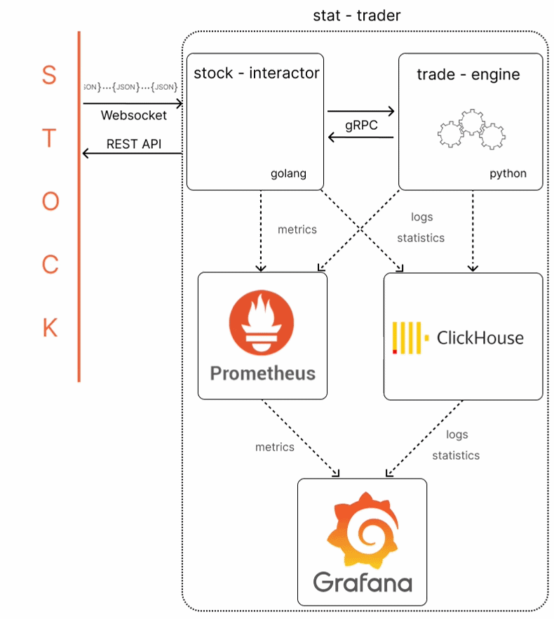
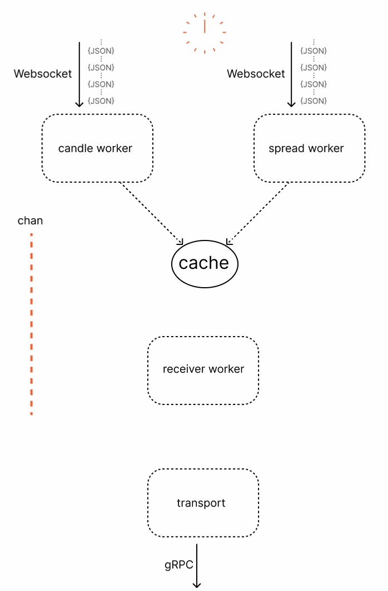
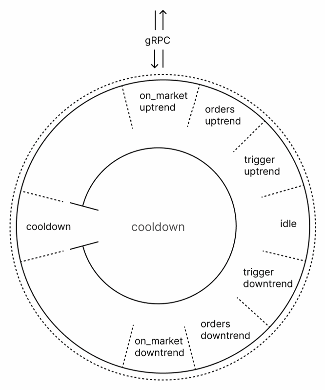
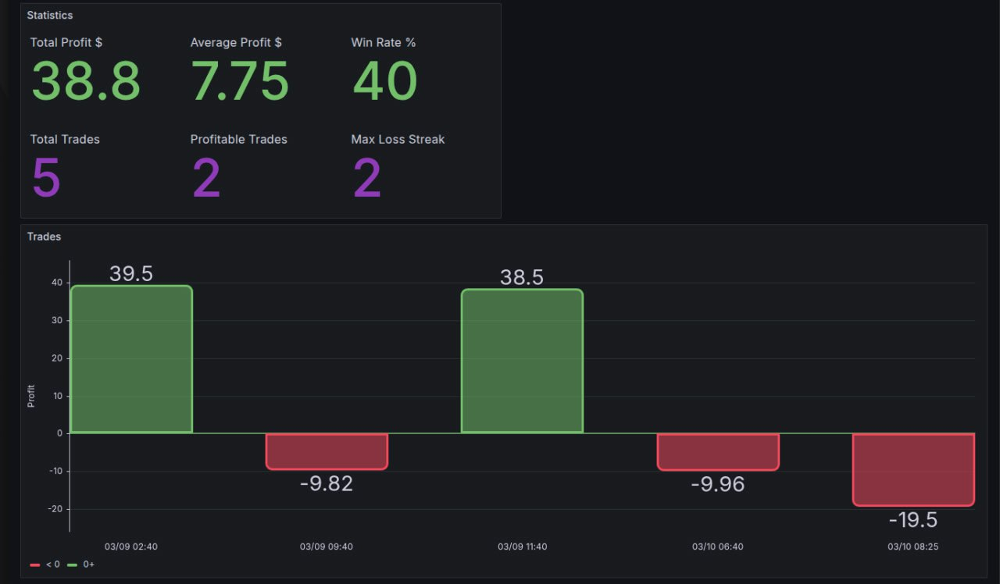
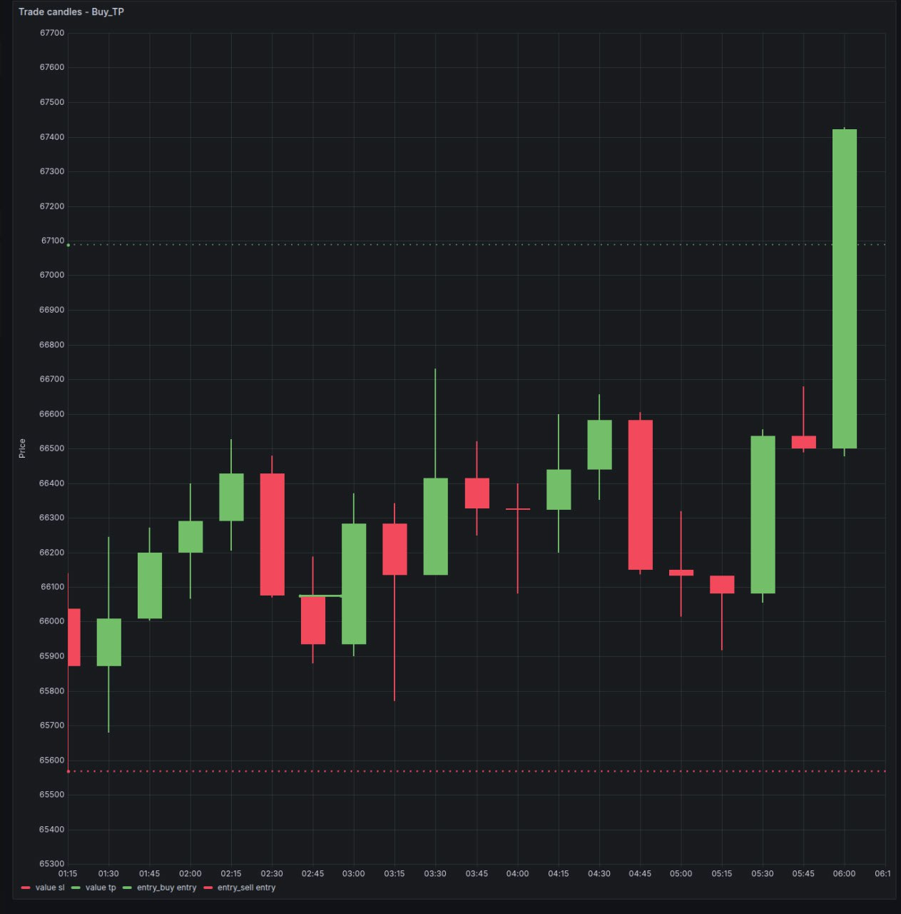
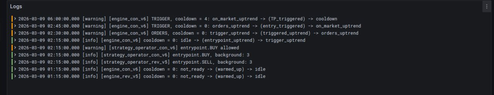
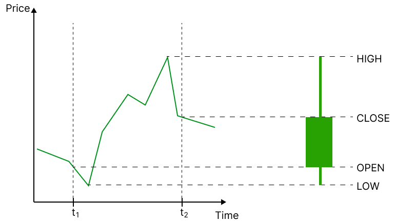

[English version](README.md)

# Что такое stat-trader?
Торговля на бирже - это потенциально высокодоходная деятельность, имеющая ряд сложностей:

* для эффективной торговли необходимо постоянно следить за ценой на бирже
* требуется опыт интерпретации ценового графика
* для устойчивой торговли нужно иметь торговую стратегию
* необходима железная дисциплина следовать торговой стратегии, что психологически трудно в моменты, когда она приносит убытки

Как результат, 98% участников рынка теряют деньги.

Stat-trader - это алготрейдинговая система, закрывающая эти сложности:

* stat-trader обрабатывает каждую новую [свечу](#candle) непрерывно 24 часа в сутки
* stat-trader имеет [торговую стратегию](#trade_strategy) и строго следует ей
* stat-trader выжидает статистически выгодную точку входа и принимает решение о входе в рынок, либо о пропуске
* stat-trader рассчитывает ценовые уровни, на которых будет осуществляться сделка, stop loss и take profit
* stat-trader вычисляет объем позиции для сделки исходя из [учета торговых рисков](#risk_management)
* stat-trader ведет статистику по сделкам и отображает свечные графики

# Stat-trader
Stat-trader представляет собой группу взаимодействующих сервисов.


*стрелки указывают направление потока данных*

***клик по схеме активирует анимацию***

- [**Stock-interactor**](#stock_interactor). Сервис для взаимодействия с биржей. Stock-interactor получает данные по Websocket и использует API биржи для открытия/закрытия сделок. Дополнительно, он может получить данные истории биржи за указанный интервал. Разработан на Golang.
- [**Trade-engine**](#trade_engine). Сервис для принятия торговых решений и вычисления параметров сделок. Trade-engine последовательно получает данные о каждой закрытой свече в момент ее закрытия. Trade-engine принимает решения открывать или не открывать сделку. Производит вычисление параметров сделок - тип и направление ордера, цена открытия сделки, stop loss, take profit. Разработан на Python.
- [**Мониторинг**](#logging_and_monitoring). Основным инструменом мониторинга работы является Grafana. В качестве источников данных служат Prometheus и Clickhouse. Собмраются метрики, детальная статистика по торговле и логи.

Основная цель выбора данной архитектуры - гибкость в работе и обслуживании. Каждый компонент системы слабо связан с остальными. При отказе одного, остальные продолжают свою работу. Доработка какого-либо процесса затрагивает только один компонент и не влияет на остальные. Например, смена торгового инструмента или биржи потребует перенастройки stock-interactor, в то время как все остальное затронуто не будет.

<a id="stock_interactor"></a>
# Stock-interactor
На схеме изображено как сервис получает текущую [свечу](#candle) и передает ее дальше


***клик по схеме активирует анимацию***

<a id="timing_requirements"></a>
В данном сценарии работы важно передать данные в нужный момент. Этот момент - за 500 мс до закрытия текущей [свечи](#candle). Времени хватает на весь процесс обработки ( с учетом внутренних коммуникаций) и на доставку HTTP запроса до биржи.

Worker сразу определяет время закрытия [свечи](#candle) и планирует в это время передачу данных. Все остальное время он получает данные из Websocket стрима, и записывает их в потокобезопасный кэш. В нужный момент он копирует данные из кэша в соответствующий канал.

В stock-interactor были применены следующие технические решения:
- в основе всего **clean architecture**. Функционал объединен в слои. Слои зависят от интерфейсов
- слой получения данных с биржи (ticker) работает **асинхронно**. Запущены несколько worker'ов, которые синхронизируются между собой через каналы
- читающие Websocket worker'ы **автоматически переподключаются** к стримам в случае ошибок
- все необходимые для работы параметры передаются из переменных окружения и записываются в конфигурационную структуру [env.go](stock-interactor/internal/config/env.go)
- сервис умеет контролируемо завершать свою работу - **graceful shutdown**. В этот момент закрываются все внешние соединения. Worker'ы закрывают открытые каналы и прекращают свою работу
- в сервисе налажен сбор [метрик](stock-interactor/internal/metrics/collector.go)
- в консоль пишутся **логи**
```golang
logger := slog.New(pkgLogger.NewPrettyHandler(os.Stdout, &slog.HandlerOptions{
		Level: slog.LevelDebug,
	}))

...

if err != nil {
	logger.ErrorContext(ctx, fmt.Sprintf("Error: %v", err))
}
```
- **ошибки** обернуты, передается контекст
```golang

import emperror "emperror.dev/errors"

...

if err != nil {
	return emperror.Wrapf(err, "application.Start")
}
```

<a id="trade_engine"></a>
# Trade-engine
На схеме изображено как сервис переключает состояния.


***клик по схеме активирует анимацию***

Реализация в виде конечного автомата - это элегантный способ представления кода, для которого можно выделить отдельные состояния и переходы между ними. 

Технические решения, которые были применены в trade-engine:
- код [основных классов](trade-engine/services/trade_engine/trade_engine_continual_v6.py) сервиса организован в виде **state machine**. Это позволяет описать сложную логику, сохраняя читаемость и тестируемость кода
- для создания логики множественных переходов в новом состоянии был придуман и внедрен паттерн **cascades**. Это, можно сказать, частный случай рекурсии с фиксированым числом (и измененной логикой) повторных вызовов
```python
def handle_first(...) -> ...
    ... ## Логика состояний/переходов

    return handle_second(...)

def handle_second(...) -> ...
    ... ## Логика состояний/переходов

    return ...
```
- подробное [тестирование](trade-engine/tests) логики. Все тесты параметризированные, представляют собой декларативную спецификацию на тестируемый код
- внедрен паттерн **strategy**. Логика разделена на ряд интерфейсов. Это кодовая практика, перенесенная из Golang
- сервис основан на **clean architecture**, как и stock-interactor
- необходимые для работы параметры сервис получает из переменных окружения и хранит в классе [Config](trade-engine/config/config.py), значения параметров проходят валидацию
- trade-engine использует настраиваемый **logger** для добавления логов в консоль
```python
    base_logger = logging.getLogger(cfg.VERSION)
    base_logger.setLevel(logging.INFO)
    base_logger.addHandler(stream_handler)

    logger = logging.LoggerAdapter(base_logger, {"engine_id": cfg.VERSION})

    ...

    self.logger.info(
                    "%s | %s -> (%s) -> %s",
                    last_close_time,
                    source.id,
                    event,
                    self.current_state.id,
                )
```
- так же запись логов ведется в Grafana. Для этого используется [**metric repository**](trade-engine/services/metric_repository/clickhouse_metric_repository.py). Кроме логов сервис сохраняет торговую статистику. Так как имеются [требования](#timing_requirements) к длительности обработки данных, реализован [**асинхронный**](trade-engine/services/metric_repository/async_metric_repository.py) режим работы **metric repository**
- поскольку сервис обрабатывает любые поступающие [свечи](#candle), разработан функционал [проверки доходности](trade-engine/services/tester/) на исторических данных. Сервис запрашивает данные за указанный временной интервал и полученные [свечи](#candle) пропускает через себя, считая прибыль и формируя отчеты в Grafana

<a id="logging_and_monitoring"></a>
# Логирование и мониторинг
Для отображения того, что происходит в сервисах, а так же для визуализации торговых результатов используется grafana. Данные для визуализации поступают из двух источников данных - prometheus и clickhouse.

Пример графика сделок:


Кликнув на каждую сделку, можно отобразить обработанные свечи или логи

Пример графика [свечей](#candle):


Пример логов:


<a id="candle"></a>
# Свеча
Японская свеча, торговая свеча и т.п. - это компактное представление изменения цены за конкретный временной интервал.



- Наибольшая цена соответствует HIGH свечи
- Наименьшая цена - LOW
- Цена на момент начала отсчета времени - цена открытия - OPEN
- Цена на момент завершения отсчета времени - цена закрытия - CLOSE

Если OPEN < CLOSE - то говорят "бычья" свеча, обычно отображают зеленым (как на картинке)

Если OPEN > CLOSE - соответственно, "медвежья" свеча, обычно отображают красным

<a id="trade_strategy"></a>
# Торговая стратегия
Это набор правил, соблюдение которых позволяют отвечають на следующие вопросы:

- Определение рынка:
    - Какой рынок, торговый инструмент, таймфрейм торгуется?

- Вхождение в рынок:
    - Каких сигналов нужно дождаться для открытия сделки? При каких сигналах сделка должна быть проигнорирована?

- Расчет позиции:
    - Тип ордера? Цена, на которой открывается сделка? Какой объем сделки? Какой stop loss? Какой take profit?

- Сопровождение сделка:
    - Должна ли сделка оставаться открытой? Какой согнал для закрытия сделки?

- Убыток по сделке:
    - Нужно ли приостанавливать торговлю? Нужно ли повторно открывать сделку?

Без торговой стратегии сложно прибыльно торговать на среднесрочном или долгосрочном интервале времени. При наличии торговой стратегии, сложно ее не нарушать

<a id="risk_management"></a>
# Учет рисков
Каждая сделка обязательно имеет stop loss. Это ценовый уровень при достижении которого она теряет всякий смысл и должна быть закрыта с убытком.
По правилам торгового движка, если по сделке имел место убыток 0.5 % от общего депозита, должен сработать stop loss.

Это базовое правило стабильной торговли. Оно обеспечивает безопастность торговли и позволяет "пережить" многократные убыточные сделки

## Пример
Допустим, имела место неудачная серия сделок.

- при 1 неудачнй сделке депозит потеряет 0.5 %
- при большем количестве неудачных сделках вступает в силу сложный процент:
    - при второй неудачной сделках депозит потеряет (0.005)*(1-0.005), т.е. уже не 0.5%, а 0.4975%. Суммарная потеря при двух неудачных сделках составит 0.9975%
    - при 3-й неудачной сделке депозит потеряет (0.005)*(1-0.005)^2, т.е 0.4950125%. Сумарная потеря составит 1.49 %
    - при 10-й неудачной сделке депозит потеряет (0.005)*(1-005)^9, т.е 0.478%. Суммарная потеря составит 4.889 %
    - при 100-й неудачной сделке суммарная потеря составит 39.35 %

Другими словами даже длительная череда неудачных сделок не может привести к потере депозита. 