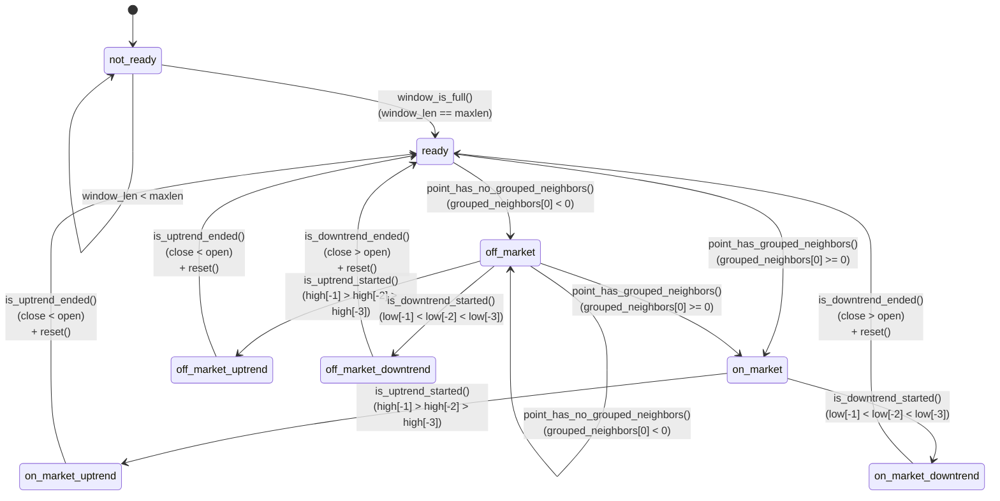

# TradeEngineReversalV2 - Документация

## Обзор
`TradeEngineReversalV2` - это торговый движок, построенный на основе конечного автомата (Finite State Machine). Система управляет торговыми решениями на основе анализа свечей, векторизации паттернов и группировки точек на scatter-диаграмме.

## Архитектура состояний

### Состояния системы

| Состояние | Описание |
|-----------|----------|
| `not_ready` | Начальное состояние, накопление данных |
| `ready` | Данные готовы, анализ соседей |
| `on_market` | Точка имеет сгруппированных соседей |
| `off_market` | Точка изолирована |
| `on_market_uptrend` | Восходящий тренд с группой |
| `on_market_downtrend` | Нисходящий тренд с группой |
| `off_market_uptrend` | Восходящий тренд без группы |
| `off_market_downtrend` | Нисходящий тренд без группы |

## Граф состояний и переходов



## Детальное описание переходов

### 1. Инициализация системы
```
[*] → not_ready
```
- **Условие**: Автоматический переход при создании объекта
- **Действие**: Инициализация пустого окна свечей

### 2. Накопление данных
```
not_ready → not_ready
```
- **Условие**: `len(window) < window.maxlen` (по умолчанию 11)
- **Действие**: Добавление свечи в окно

### 3. Готовность к анализу
```
not_ready → ready
```
- **Условие**: `window_is_full()` - окно заполнено (len == maxlen)
- **Действие**: `on_enter_ready()` - создание точки из последних 8 свечей

### 4. Определение наличия группы
```
ready → on_market
ready → off_market
```
- **on_market**: `point_has_grouped_neighbors()` - есть сгруппированные соседи (grouped_neighbors[0] >= 0)
- **off_market**: `point_has_no_grouped_neighbors()` - нет группы (grouped_neighbors[0] < 0)
- **Действие on_market**: `on_enter_on_market()` - сохранение pre = последние 8 свечей

### 5. Начало трендов
```
on_market → on_market_uptrend/downtrend
off_market → off_market_uptrend/downtrend
```
- **Uptrend**: `is_uptrend_started()` - три последовательно растущих максимума
- **Downtrend**: `is_downtrend_started()` - три последовательно падающих минимума
- **Действие**: Установка направления точки, сохранение order_candle

### 6. Переход между market/off_market
```
off_market → on_market
off_market → off_market
```
- **Условие**: Периодическая проверка grouped_neighbors для новых точек
- **Действие**: Обновление состояния в зависимости от появления/исчезновения группы

### 7. Завершение трендов
```
*_uptrend → ready
*_downtrend → ready
```
- **Условие**: `is_uptrend_ended()` (close < open) или `is_downtrend_ended()` (close > open)
- **Действие**:
  - Проверка значимости тренда `is_significant()`
  - Если значимый: `scatter.regroup(point)`
  - Если нет: `scatter.remove_last_point()`
  - Расчет прибыли/убытков
  - `reset()` - очистка состояния
  - Переход в `ready` для нового анализа
  - Возврат `Decision(action=Action.CLOSE)`

## Ключевые методы условий

### window_is_full(window_len: int) → bool
```python
return window_len == self.window.maxlen
```
Проверяет, заполнено ли окно свечей до максимального размера.

### point_has_grouped_neighbors(grouped_neighbors: Tuple[int, int]) → bool
```python
return grouped_neighbors[0] >= 0
```
Определяет, есть ли у точки сгруппированные соседи на scatter-диаграмме.

### is_uptrend_started(candles: List[Candle]) → bool
```python
return candles[-1].high > candles[-2].high > candles[-3].high
```
Проверяет начало восходящего тренда по трем последовательно растущим максимумам.

### is_downtrend_started(candles: List[Candle]) → bool
```python
return candles[-1].low < candles[-2].low < candles[-3].low
```
Проверяет начало нисходящего тренда по трем последовательно падающим минимумам.

### is_uptrend_continues(candle: Candle) → bool
```python
return candle.close > candle.open
```
Определяет, продолжается ли восходящий тренд (зеленая свеча).

### is_downtrend_continues(candle: Candle) → bool
```python
return candle.close < candle.open
```
Определяет, продолжается ли нисходящий тренд (красная свеча).

### is_uptrend_ended(candle: Candle) → bool
```python
return candle.close < candle.open
```
Определяет, завершился ли восходящий тренд (красная свеча после роста).

### is_downtrend_ended(candle: Candle) → bool
```python
return candle.close > candle.open
```
Определяет, завершился ли нисходящий тренд (зеленая свеча после падения).

### point_has_no_grouped_neighbors(grouped_neighbors: Tuple[int, int]) → bool
```python
return grouped_neighbors[0] < 0
```
Проверяет отсутствие сгруппированных соседей у точки.

## Действия при входе в состояния

### on_enter_ready()
- Создание точки из последних 8 свечей окна
- Векторизация через UMAP и скейлеры
- Подготовка к анализу соседей

### on_enter_on_market()
- Сохранение `pre = последние 8 свечей`
- Подготовка к отслеживанию тренда
- Инициализация торговой позиции

### reset()
- Очистка `point`, `order_candle`, `pre`, `trend`
- Сброс флагов (`is_sl_triggered`)
- Возврат системы в исходное состояние

## Особенности реализации

### 1. Stop Loss логика
Отслеживается в состояниях `*_uptrend`/`*_downtrend`:
```python
if (point.direction == Direction.UP and candle.low < order_candle.low) or \
   (point.direction == Direction.DOWN and candle.high > order_candle.high):
    is_sl_triggered = True
    total -= order_candle.open - candle.low
```

### 2. Значимость тренда
```python
def is_significant(self) -> bool:
    value = last_candle.high - first_candle.open  # для UP
    # или
    value = first_candle.open - last_candle.low   # для DOWN
    return value > self.avg_candle_len * 2.5
```

### 3. Векторизация
- 44-параметрический вектор характеристик паттерна
- Нормализация через `StandardScaler`
- Проекция через обученную UMAP модель
- Масштабирование координат через `MinMaxScaler`

### 4. Группировка
- k-NN алгоритм для определения соседей точки
- Оптимизированный scan_radius для производительности
- Секторальное сканирование для ускорения поиска

## Возвращаемые решения

| Action | Условие | Параметры |
|--------|---------|-----------|
| `Action.WAIT` | Основное состояние, ожидание | sl=0, tp=0, percent=50 |
| `Action.CLOSE` | При завершении значимого тренда | sl=0, tp=0, percent=50 |

### Параметры решений
- **sl**: Stop Loss уровень
- **tp**: Take Profit уровень
- **percent**: Процент от депозита для позиции

## Пример использования

```python
# Инициализация
trade_engine = TradeEngineReversalV2(
    scatter=scatter,
    vectorizer=vectorizer,
    reducer=umap_model,
    window_size=11,
    avg_candle_len=1.5
)

# Обработка свечи
decision = trade_engine.handle(new_candle)
print(f"State: {trade_engine.current_state.id}")
print(f"Action: {decision.action}")
```

## Диагностика и отладка

### Полезные свойства для мониторинга:
- `trade_engine.current_state.id` - текущее состояние
- `trade_engine.last_state_id` - предыдущее состояние
- `len(trade_engine.window)` - размер окна
- `len(trade_engine.pre)` - размер прелюдии
- `len(trade_engine.trend)` - длина текущего тренда
- `trade_engine.total` - накопленная прибыль/убыток
- `trade_engine.is_sl_triggered` - флаг срабатывания Stop Loss

### Визуализация состояния:
```python
trade_engine.scatter.visualize("current_state.png", debug=True)
```

## Тестирование

Система протестирована на 20 различных сценариях, включающих:
- Переходы между всеми состояниями
- Обработку трендов различной длины и направления
- Срабатывание Stop Loss
- Значимые и незначимые тренды
- Группировку и изоляцию точек

Все тесты находятся в `tests/test_trade_engine_FSM.py`.